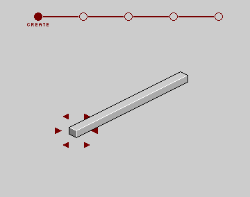
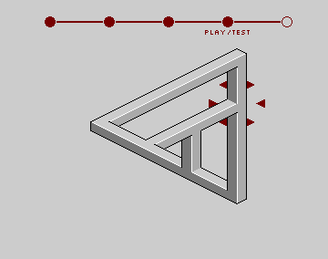
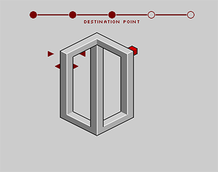
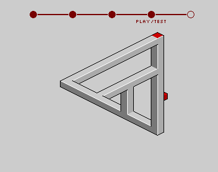

# impsbru

A impossible shapes logic game for Amiga.






## Getting Started

Follow the edges of the shapes with red cube and finish the level by walking on the red rectangle. It's tricky because shapes are impossible to exist in 3 dimensions. Squeeze your brain!

### Pre-requirements

This game is made for specific hardware. To properly run this game you will need:

* Literally any Amiga (but tested with Amiga 500 and Kickstart 1.3)

or compatible Amiga emulator like [WinUAE](http://www.winuae.net/).

### Installing

Copy the [latest game release](https://github.com/approxit/impsbru/releases) archive and extract to directory that Amiga can load. The `bin` and `data` directories must coexist as given. 

### Running the game

Game must be stared from main executable file located in `bin/impsbru`.
In AmigaDOS CLI you can use following commands:

```
1> cd impsbru/bin
1> impsbru
``` 

## Controls

### Menu

* **<kbd>escape</kbd> / <kbd>backspace</kbd>** - exits the game 
* **<kbd>return</kbd> / <kbd>space</kbd>** - enters to *map editor*

### Map Editor

#### Create, Start point and Destination point steps

* **<kbd>q</kbd> / <kbd>w</kbd> / <kbd>e</kbd>** - toggles element at `north west` / `north` / `north east` direction of the cursor, if possible
* **<kbd>z</kbd> / <kbd>x</kbd> / <kbd>c</kbd>** - toggles element at `south west` / `south` / `south east` direction of the cursor, if possible

* **<kbd>u</kbd> / <kbd>i</kbd> / <kbd>o</kbd>** - moves cursor at `north west` / `north` / `north east` direction, if possible
* **<kbd>m</kbd> / <kbd>,</kbd> / <kbd>.</kbd>** - moves cursor at `south west` / `south` / `south east` direction, if possible

* **<kbd>escape</kbd> / <kbd>backspace</kbd>** - goes back to previous step or exists menu 
* **<kbd>return</kbd> / <kbd>space</kbd>** - goes to next step, if step requirements are met

* **<kbd>1</kbd> to <kbd>0</kbd>** - loads example map from one of 10 slots

#### Play / test step

* **<kbd>q</kbd> / <kbd>w</kbd> / <kbd>e</kbd>** - moves cube at `north west` / `north` / `north east` direction of the cursor, if possible
* **<kbd>z</kbd> / <kbd>x</kbd> / <kbd>c</kbd>** - moves cube at `south west` / `south` / `south east` direction of the cursor, if possible

* **<kbd>u</kbd> / <kbd>i</kbd> / <kbd>o</kbd>** - moves cube at `north west` / `north` / `north east` direction, if possible
* **<kbd>m</kbd> / <kbd>,</kbd> / <kbd>.</kbd>** - moves cube at `south west` / `south` / `south east` direction, if possible

* **<kbd>escape</kbd> / <kbd>backspace</kbd>** - goes to previous step

* **<kbd>1</kbd> to <kbd>0</kbd>** - loads example map from one of 10 slots

#### Share step

* **<kbd>shift</kbd> + <kbd>1</kbd> to <kbd>shift</kbd> + <kbd>9</kbd> and <kbd>shift</kbd> + <kbd>0</kbd>** - saves current map to one of 10 slots
* **<kbd>escape</kbd> / <kbd>backspace</kbd>** - goes back to *play / test* step 

## Built With

* [Amiga C Engine](https://github.com/approxit/ACE) - game engine
* [Amiga C Engine CLI](https://github.com/approxit/ace-cli) - build tool
* [amiga-dev](https://github.com/kusma/amiga-dev) - VBCC+VASM+VLINK development environment
* [Photoshop](http://www.adobe.com/products/photoshop.html) - graphics editor

## Versioning

This project use [SemVer](http://semver.org/) for versioning. For the versions available, see the [tags on this repository](https://github.com/approxit/impsbru/tags). 

## Authors

* **[approxit](https://github.com/approxit)** - initial work

## License

This project is licensed under the MIT License - see the [LICENSE.md](LICENSE.md) file for details.